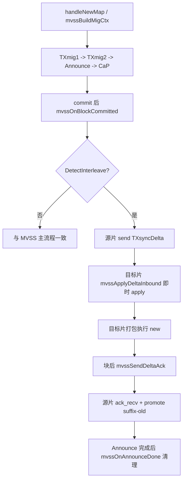

# 账户迁移全流程时序（工程语义）

本文描述本仓库在 **`Stop_When_Migrating = false`** 时，一次账户从源分片迁到目标分片的**固定流水线**与各阶段语义。  
策略对比（SOTA-Lock / Fine-tuned-Lock / MVSS）见 [账户迁移策略对比.md](./账户迁移策略对比.md)；`-m` 参数见 [参数配置.md](./参数配置.md)。

---

## 一、先回答：三种策略走同一套流程吗？

**是，骨架相同；不只是「每个阶段锁法不同」。**

| 层次 | 三种策略是否一致 |
|------|------------------|
| 消息与出块顺序 | **一致**：TXmig1 → TXmig2 → Announce → 收尾（CaP + 可选 NS） |
| 跨分片 TCP 消息类型 | **一致**：`cTXmig1`(载荷 Mig2)、`cAnnounce`、`cCaP` |
| 迁移期对普通 tx 的处理 | **不一致**：全锁 / 半锁 / 分流+重定向+TXsync |

可以记成：

```text
相同流水线 + 在「TXmig1 上链之后 ~ Announce 收尾之前」采用不同的交易调度策略
```

**例外**：`-m stop_epoch` 走停机 epoch 路径（`PBFTforMigrate.go`），**不是**本文四阶段流水线，不参与三策略对比。

---

## 二、参与方

| 角色 | 职责 |
|------|------|
| **Client** | CLPA/PageRank 等算 `new_addr2shard`，`SendNewAddr2Shard` 广播新映射 |
| **源分片 Sx.N0** | 发现迁出账户、打包 TXmig1、处理 Announce、发 CaP |
| **目标分片 Sy.N0** | 收 Mig2、打包 TXmig2、发起 Announce |
| **其余分片** | 收 Announce，更新映射；若与本片无关则只改表 |

---

## 三、四阶段总览

```text
[0] 新映射下发          Client → 各分片 handleNewMap
[1] TXmig1（迁出宣告）   源片出块 → 状态标记 Migrate → 策略标记生效
[2] TXmig2（迁入落地）   源片 TryTXmig1 → 目标片出块接管账户
[3] Announce（全网公告） 目标片 TryAnnounce → 各片出块 TXann
[4] 收尾（收敛）         源片 handleAnns → CaP(+NS) → 目标片消化 pending
```

各阶段占用的**块类型**（同一区块可同时含普通 tx，但迁移条目占 `MaxBlockSize` 配额）：

| 阶段 | 块内条目 | 谁出块 |
|------|----------|--------|
| TXmig1 | `block.TXmig1s` | **源分片** |
| TXmig2 | `block.TXmig2s` | **目标分片** |
| Announce | `block.Anns` | **各分片**（收到公告后入池再打包） |
| 收尾 NS | `block.NSs`（可选） | 源片等在 `handleAnns` 里生成后发 CaP |

---

## 四、分阶段语义

### 阶段 0：新映射下发（迁移尚未上链）

1. Client 用固定算法（如 **CLPA**，`PorC`）得到 `new_addr2shard`。
2. `SendNewAddr2Shard` → 各分片 `handleNewMap`。
3. 对 **本片拥有且目标片变化** 的账户 `A`：
   - 写入 `TXmig1_pool`（待打包的迁出请求）；
   - 给交易池里涉及 `A` 的 tx 打上 **`TXmig1_Time`**（后文「老/新交易」时间分界）；
   - **仅 MVSS**：`mvssBuildMigCtx`，生成带 `OrderList/LastCN/Sync` 的 TXmig1 元数据。

此时尚未迁移，只是**排队等待源片下一次打包 TXmig1**。

---

### 阶段 1：TXmig1 —— 源分片宣告「账户要迁出」

**出块**：`GenerateBlock` 从 `TXmig1_pool` 取条目，与 mig2/ann/ns、普通 tx 一起组块。

**链上效果**（`AddBlock` → `getUpdatedTreeOfState`）：

- 账户 `A` 状态：`A.Migrate = 目标分片号`（仍留在源片状态树，但标记去向）；
- 记录 **`BalanceBeforeOut[A]`**（迁出前余额，供收尾算差额 / NS）。

**Commit 后按策略打标**（`pbft.go` commit 路径，三选一）：

| 策略 | TXmig1 上链后立即生效 |
|------|------------------------|
| **SOTA-Lock** | `Lock_Acc[A]=true`，`Locking_TX_Pools[A]` |
| **Fine-tuned-Lock** | `Outing_Acc_Before_Announce[A]=true`，`Outing_Before_Announce_TX_Pools[A]` |
| **MVSS / original** | `Not_Lock_Acc[A]=true`（**不是**把全部 tx 锁死；MVSS 在此后走分流） |

**迁出后立刻**：源片 `TryTXmig1`，把带状态与证明的 **TXmig2** 经 `cTXmig1` 发给目标分片 `Sy.N0`（`handleMig2` 入 `TXmig2_pool`）。

**迁移窗口**：从本块 commit 起，到 Announce 收尾完成前，普通 tx 如何进块由策略决定（见 §六）。

---

### 阶段 2：TXmig2 —— 目标分片接管账户状态

**出块**：目标分片 `Sy` 从 `TXmig2_pool` 打包 `TXmig2`。

**链上效果**：

- 目标片状态树写入 `A` 的余额等信息；
- `A.Migrate = -1`，`A.Location = Sy`；
- `AddBlock`：`AccountInOwnShard[A]=true`（目标片正式「拥有」该账户）。

**仅 MVSS**：`handleMig2` 时 `SetMigCtx`（目标片校验重定向 tx 的 nonce/RedirectTag）。

**迁出后立刻**：目标片在本块 commit 后调用 **`TryAnnounce`**，向全网广播 `cAnnounce`（每个迁入账户一条 `TXann`）。

---

### 阶段 3：Announce —— 全网同步归属

1. 各分片 `handleAnnounce` → `TXann_pool`。
2. 各分片在后续区块中打包 `TXann` 上链。
3. **源分片**打包到自己产生的 Announce 时，执行 **`handleAnns`**（核心收尾入口）：
   - `Account2Shard[A]=Sy`；
   - 从 `AccountInOwnShard` **删除** `A`（源片不再拥有）；
   - 清除策略标记（`Lock_Acc` / `Not_Lock_Acc` / `Outing_*`）；
   - 从主队列、锁池/半锁池中**收集**与 `A` 相关的 pending tx，装入 `ChangeAndPending`。

**仅 MVSS**：`mvssOnAnnounceDone` 删除迁出侧 `MigCtx`。

对 **本来就不在源片** 的账户，Announce 只更新 `Account2Shard` 表，不跑完整迁出清理。

---

### 阶段 4：收尾 —— CaP（+ 可选 NS）

**源分片** `handleAnns` 末尾 → **`TrySendChangesAndPendings`**（`cCaP`）：

| 载荷 | 含义 |
|------|------|
| **PendingTxs** | 迁移期挂在锁池/半锁池/队列里、与 `A` 相关的 tx，发往目标片继续处理 |
| **TXns**（可选） | 迁出期间余额变化量（`BalanceBeforeOut` 与当前状态差），目标片用 NS 调账 |

**目标分片** `handleChangesAndPendings`：pending 并入 `Tx_pool.Queue`，后续正常出块执行。

至此：**归属、状态、迁移期积压 tx** 从 Sx 收敛到 Sy；迁移窗口结束。

**MVSS 额外收尾**（与 CaP 并行存在）：块提交后若检测到时间戳交错，`mvssTriggerSyncIfNeeded` 发 **`TXsync`**，目标片状态经 `MigPendingState` 合并（见 `mvss_sync.go`）。

---

## 五、与论文概念的粗略对应

| 工程阶段 | 论文/设计中的直观含义 |
|----------|------------------------|
| TXmig1 | 迁出宣告 / TX_ini 触发（MVSS 在元数据中带 Sync、OrderList） |
| TXmig2 | 目标片创建账户并写入状态（迁入） |
| Announce | 全网可知新归属 |
| CaP + pending | 迁移期未处理完的关联交易交付目标片 |
| NS | 迁出片在迁移窗口内的余额净变化补偿 |
| TXsync（MVSS） | Stage 3 状态桥接（简化实现，非完整多轮协议） |

---

## 六、三策略在「同一流水线」上的差异（不只锁不同）

骨架都是 §三 四阶段；差异集中在 **阶段 1 之后 ~ 阶段 4 之前** 对**普通交易**的处理。

| 行为 | SOTA-Lock | Fine-tuned-Lock | MVSS |
|------|-----------|-----------------|------|
| 迁出账户 sender tx | 锁入 `Locking_TX_Pools` | 锁入 `Outing_Before_*`（仅 Payer） | **老 tx 继续打包**；新 tx **重定向**到 Sy |
| 迁出账户 recipient tx | **也锁** | 可继续 / relay | 老 tx 继续；新到达走 relay/重定向 |
| 迁移期状态同步 | 主要靠锁 + CaP | 半锁 + CaP | **TXsync**（+ 将来 Delta） |
| 防重放 | 锁 + 执行顺序 | 锁 + relay 改造 | **RedirectTag + nonce** |

**`original`**：流水线与 MVSS **相同**，`Not_Lock_Acc` 与 CaP 路径相同，但 **不启用** `IsMVSS()` 下的重定向、TXsync、nonce 等分支，仅作工程对照，不是论文 MVSS。

---

## 七、时序简图（单账户 A：Sx → Sy）

```text
Client          Sx (源)                    Sy (目标)              其他分片
  |                |                          |                      |
  |-- new map ---->| handleNewMap             |                      |
  |                | TXmig1_pool              |                      |
  |                |-- block(TXmig1) -------->|                      |
  |                | 策略标记+TryTXmig1 ----->| handleMig2→pool      |
  |                |                          |-- block(TXmig2)      |
  |                |                          | TryAnnounce -------->| TXann_pool
  |                |<-------------------------|                      |
  |                |-- block(TXann)           |-- block(TXann)       | ...
  |                | handleAnns→CaP --------->| handleCaP→入队       |
  |                |                          | 执行 pending         |
```

---

## 八、正确性检查点（联调/写论文时）

1. **触发**：`handleNewMap` 是否只对 `AccountInOwnShard` 且目标片变化的账户生成 TXmig1。  
2. **时间分界**：`TXmig1_Time` 与 `RequestTime` / `Second_RequestTime` 是否与策略一致（尤其 MVSS 新 tx 重定向）。  
3. **Announce 收敛**：`handleAnns` 是否更新映射、清标记、收集 pending 并 CaP。  
4. **目标片**：`TXmig2` 后 `AccountInOwnShard` 是否在 Sy 为 true；CaP 后 pending 能否继续打包。  
5. **策略别混用**：对比实验只改 `-m`，Relay 与 `PorC` 固定。

---

## 九、相关文档

- [账户迁移策略对比.md](./账户迁移策略对比.md) — 三策略差异与控制变量  
- [参数配置.md](./参数配置.md) — `-m` 与实验矩阵  
- [代码论文区别.md](./代码论文区别.md) — 论文机制与代码差距  

---

## 十、MVSS-Delta 调用链（最小可行实现）

### 10.1 关键结论

- 当 **未触发时间戳交错**（`DetectInterleave=false`）时，`MVSS` 与 `MVSS-Delta` 主流程基本一致。
- 当触发交错且需要同步时：
  - `-m MVSS`：走 `TXsync`；
  - `-m MVSS-Delta`：走 `TXsyncDelta`；
  - Delta 校验失败：**直接 abort**（无回退到全量 `TXsync`）。

### 10.2 代码调用顺序（按一次账户迁移 + 探针交错）

与 MVSS **共享控制面**（`DetectInterleave`、Pause tx3、打包约束、探针 Phase A/B）；**分叉数据面**（增量 sync 替代全量 `TXsync`）。

1. `handleNewMap` → `mvssBuildMigCtx`（含 `mvssProbeEarlyPauseSuffixOld`）。  
2. `TXmig1 → TXmig2 → Announce → CaP` 骨架与 MVSS 一致。  
3. 每块提交后 `pbftsingle.commit1 → mvssOnBlockCommitted`：  
   - 源片 `PauseOld` 且 prefix-old 就绪 → `mvssSendSyncForAddr` 构造 **`TXsyncDelta`** 并 `TrySendTXsyncDelta`；  
   - 目标片 new 上链后 → `mvssSendDeltaAck`（块后回传 ack delta）。  
4. 目标片 `handleTXsyncDelta`（`sequenceLock` 串行）：  
   - `mvssApplyDeltaInbound` 校验 → **`ApplyMVSSAccountDelta` 即时落盘** → `MigFSMSyncApplied` → promote new；  
   - 校验失败 → `mvssAbortDelta`（不回退全量 sync）。  
5. 源片收到 ack delta → `mvssOnDeltaAck` → `ApplyMVSSAccountDelta` → `ResumeAfterSyncAck` → `mvssPromoteSuffixOldAfterAck`。  
6. `mvssOnAnnounceDone` 在 Stage3 未完成时暂缓清理 `MigCtx`。

### 10.3 MVSS-Delta 时序图


